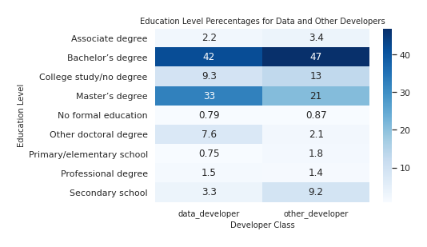
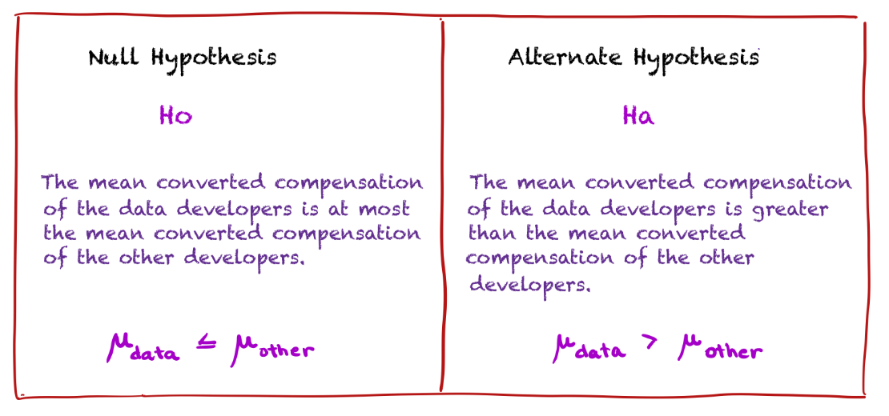
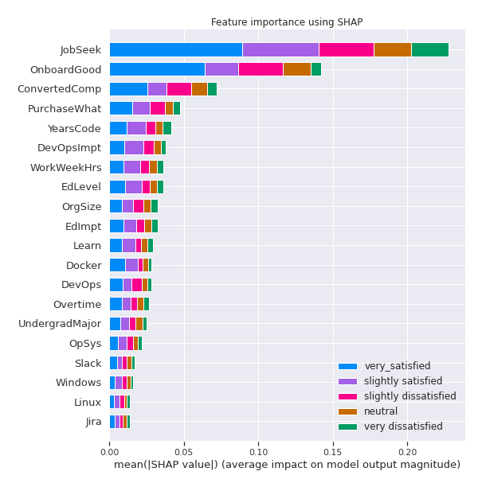

# Analysis of 2020 Stack Overflow Developers Survey


***

_A non-technical compilation of the most relevant results is available in this [Medium post](https://medium.com/@silviaonofrei/who-are-the-data-professionals-b81456dac51b)._

***

## Project Motivation

The collaboration platform Stack Overflow has been conducted annual surveys for a decade now. These are the largest and the most comprehensive surveys of developers ever conducted. The anonymized results of the surveys are publicly available for analysis at [Stack Overflow Annual Developer Survey](https://insights.stackoverflow.com/survey).

The 2020 Stack Overflow Survey was conducted in February 2020, just before the COVID-19 pandemic affected the entire world and it involved almost 65K developers from 184 countries and regions. The survey consists of 60 questions distributed over six areas of interest.

The present project serves two purposes. On one side, I am interested in learning more about the developers who work with big data, such as data scientists, machine learning engineers, data and business analysts, and data engineers. I call them data coders or data developers for short. On the other side, this is a showcase project for three different approaches encountered when working with data.

In this analysis I will investigate the following three questions:

1. Do data developers have more formal educational background than the other developers?
2. How does the salary of data developers compare with the salary of the other developers?
3. Predict the job satisfaction of a data developer and determine the key factors affecting it.

## Project Description

### 1. Educational background of data developers



The first question is investigated in the notebook `stackBlogQuestion1.ipynb` using EDA and in particular data visualizations.

[Notebook for Question 1 Link ](http://htmlpreview.github.io/?https://github.com/SolanaO/Developers_Survey_analysis/blob/master/reports/stackBlogQuestion1.html)

### 2. Salaries comparison of data and other developers



To address the second question, I use standard statistical methods. I conduct a Z-test for independent means to compare the averages of the converted compensation for data developers and the average converted compensation of the other developers. I found a difference in the average converted compensations of almost 19K, with a very small $p$-value, and consistent with the hypothesis that there is a difference in compensation between the two groups of developers.

The hypothesis test and the necessary data preparation can be found in the notebook `stackBlogQuestion2.ipynb`.

[Notebook for Question 2 Link ](http://htmlpreview.github.io/?https://github.com/SolanaO/Developers_Survey_analysis/blob/master/reports/stackBlogQuestion2.html)

### 3. Job satisfaction prediction for data developers



The process follows the CRISP-DM methodology. This is a multi-label classification problem for 5 levels of job satisfaction. After data preprocessing, data processing and feature engineering, the best performing classifier is chosen via KFold cross validation. The final model consists of a RandomForestClassifier whose parameters are tuned with RandomizedSearchCV.


&nbsp;

The modeling part of the project is developed in the notebook `stackBlogQuestion3.ipynb`.

[Notebook for Question 3 Link ](http://htmlpreview.github.io/?https://github.com/SolanaO/Developers_Survey_analysis/blob/master/reports/stackBlogQuestion3.html)


## File Structure
```bash
├── data
│   ├── interim                             <- Intermediate transformed data.
│   │   ├── survey20_pprocess_refactor.csv
│   │   ├── survey20_pprocessed.csv
│   │   ├── survey20_updated.csv
│   ├── processed                           <- Final data for modeling.
│   │   ├── x_test_data.csv
│   │   ├── x_train_data.csv
│   ├── raw                                 <- Original data.
│   │   ├── README_2020.txt
│   │   ├── survey20_results_public.csv
│   │   ├── survey20_results_schema.csv
├── notebooks                               <- Jupyter notebooks.
│   ├── stackBlogDataAnalysis.ipynb         <- Preliminary data investigation.
│   ├── stackBlogQuestion1.ipynb            <- Investigates question 1.
│   ├── stackBlogQuestion2.ipynb            <- Investigates question 2.
│   ├── stackBlogQuestion3.ipynb            <- Investigates question 3.
├── references                              <- References and explanatory files.
│   ├── references.ipynb
│   ├── references.html
│   ├── so_survey_2020.pdf
├── reports                                 <- Reports generated with Profiling.
│   ├── images                              <- Relevant visualizations.
│   │   ├── decision_tree_graphviz.png
│   │   ├── devType.png
│   │   ├── edLevel_heatmap.png
│   │   ├── hypothesis_test.png
│   │   ├── reduced_tree.png
│   │   ├── shap_importance_reduced.png
│   │   ├── undergradMajor_barplot.png
│   │   ├── visual_tree.png
│   │   ├── visual_tree_reduced.png
│   ├── data_report.html
│   ├── data_report_train.html
│   ├── stackBlogQuestion1.html
│   ├── stackBlogQuestion2.html
│   ├── stackBlogQuestion3.html
├── src                                     <- Source code for the project.
│   ├── __init__.py                         <- Makes src a Python module.
│   ├── models                              <- Script to train model and make predictions.
│   │   ├── model.py
│   ├── local_maps.py                       <- Dictionaries and lists used in project.
│   ├── utils_classes.py                    <- Classes defined for this project.
│   ├── utils_functions.py                  <- Functions defined for this project.
├── .gitignore
├── LICENSE
├── README.md
├── packageinfo.txt
└── requirements.txt                        <- Requirements for reproducing the environment.
```
&nbsp;
## Results

The outcomes for each question are outlined in the corresponding notebooks. A non-technical compilation of the most relevant results is available in this [Medium post](https://medium.com/@silviaonofrei/who-are-the-data-professionals-b81456dac51b).

## Requirements

The project is written in Jupyter notebooks, using Anaconda3 and Python 3.7.6. The following packages have to be imported:

        numpy == 1.19.2
        pandas == 1.2.4
        scipy == 1.6.2
        scikit_learn == 0.24.2
        xgboost == 0.90

The list of packages was obtained using Pigar.

## Specifications

[List of References](http://htmlpreview.github.io/?https://github.com/SolanaO/Developers_Survey_analysis/blob/master/references/references.html)

This analysis was completed as an open choice project in the Data Scientist Nanodegree with Udacity.
